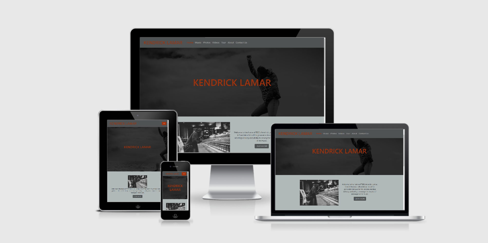
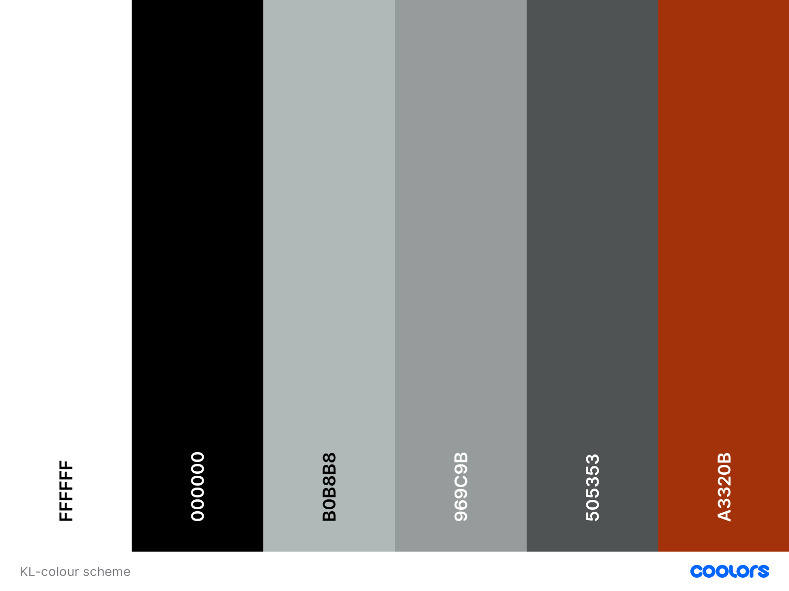

# Kendrick Lamar
 

 
**[Active link to the website portfolio](https://jblk99.github.io/Kendrick-Lamar/index.html)**
 
## Overview
 
This project is aimed at giving American rapper Kendrick Lamar a platform to interact and expand his fan base. A direct line of communication. The website will include details about the artist so that fans can learn more about him and buy his music, or be directed to where they can stream his music. They can also find details of his tours and directed to where they can purchase tickets. This will also be a point of contact for potential business ventures.
 
 
# User Experience Design
 
## User Stories
* As a user of any type, I want a clean and easy Navigation experience that can be done on my phone, tablet or computer, so I can easily navigate the website on any device 
* As a fan, I want to be able to easily access information about the artist, So I can learn more about the artist.
* As a fan, I want links to music videos the artist has posted, so that I can view them.
* As a fan, I want links to the artists music on streaming services, so I can listen to them with ease
* As a fan, I want clear information about the artist’s tours, so I can purchase tickets to see the artist perform.
* As a fan or potential fan, I want to see his discography and where I can buy/stream his music.
* As a fan, I want links to the artist’s social media, so that I can easily stay up-to-date on any news using an easily accessible platform.
* As a fan/client, I want to be able to contact Kendrick Lamar, so that I can make voice any enquires I have.
* As a client, I want to be able to view the artists music, so I can see if the artist is suitable to book for my event.
* As the artist, I want to promote my latest releases and the rest of my discography, so that I can increase purchases/streams of my music.
* As the artist, I want to allow clients to contact me, so I can receive offers for tours and potential publicity events.
* As the artist, I want to advertise up and coming tour dates, so that I can increase tour ticket sales.
 
# Design process
The design process for this project was all done using Miro, a cross-device collaboration whiteboard platform. 
## Diagrams, wireframes and mockups
* All of my design process is located on my [miro](https://miro.com/app/board/o9J_lZip5fU=/) design board

## Typography
The two fonts I selected are Roboto and Open-sans, both from [GoogleFonts](https://fonts.google.com/).
Roboto was used for the navigational links and all of my titles/subtitles. For my main body of content, I used Open-sans. I used this combination as I liked the simplistic modern look of them both and the way they complement each other.

## Colour scheme
The colour pallet was used making [Coolors.co](https://coolors.co/). I already planned to have different shades of grey and a shade of red to add a splash of colour. I chose this pallet because In my mind it closely reflects Kendrick Lamars style

## Imagery
* Hero images - All my hero images are of Kendrick Lamar in different settings excluding the contact.html page which will have the TDE music label logo as the hero image.

* **Home page** - Will contain an image of Kendrick Lamar and an image of the artwork to his latest single.

* **Music** - This page will contain images of Kendrick's album artwork next to the tracklists of these albums to assist in promoting sales.

* **Photos** - This page will contain multiple images of Kendrick Lamar on tour, in interviews and anything else to do with Kendrick Lamar that fans will want to see.

* **Tour** - As this page is promoting Kendrick Lamar's tour, there will be a photo from his last tour on the page.

* **About** - This page contains information about Kendrick Lamar so it will contain images that further show what the text is explaining.

#  Features

## Navigation

The Navigation bar is designed using Bootstap's navbar which is fixed in a horizontal position to the top. So as the users are scrolling down the webpage the Navbar will at the top of the screen for a good user experience across the whole website. I styled the navbar using the darker grey in my colour pallet and the nav links in a lighter grey so they can still be clearly seen and a hover effect of a Chinese red which is activated by hovering your mouse over the nav links. I also changed the hamburger icon background to the Chinese red to fit better with the styling of the navbar and overall website.
In this section, you should go over the different parts of your project, and describe each in a sentence or so.

## Footer

My footer will be styled with the same darker grey used in my navbar, it will include social media links that will direct you to Kendrick Lamar's Social media profiles as well as streaming service links which will take you to his artist page on the corresponding streaming service. These links will be displayed using the corresponding icons from Fontawsome. They will have identical hover effects as the navbar

## Home

The home page has a brief introduction about who Kendrick Lamar is with a link to his bio page followed by an announcement about his new single with the artwork for the single to go along with it. and to finish one of Kendricks music videos embedded underneath. I have done this for a reason. As soon as you enter the page there are 3 options of being directed to informative text about Kendrick for the fans that want to read about him or one oh his new songs for people that would like to hear his style of music. Finalised by a music video for the people that would like something visual.

## Music

This page contains Kendrick's the tracklist and album art for his 3 latest albums with links to either stream or purchase the albums accordingly. This gives the user easy access to his music which when prompted will have a chance for Kendrick to gain more streams from users that have been directed there from the website.

## Photos

This page is aimed at users who are looking for more than just his music. Users that are looking to see his style and appearance which is notably important in rap music.

## Videos

This page contains several Kendrick Lamar's music videos embedded from youtube. These videos are now not only exposed to users on the youtube website but they are now exposed to users on this website which will increase the number of views on his videos and potentially increasing his fanbase.

## Tour

This page is aimed at giving out information about tour dates that are coming soon to increase the sale of his tour tickets.

## About

This page is aimed at users that want to get to know Kendrick in more detail outside of his music. It includes details about Kendrick Lamar's background and upbringing which is spoken about in his music. This being here gives another reason for users to come to the website and explore the other pages.

## Contact

This page contains a form to contact Kendrick Lamar's Label and displays alternative methods of contact for different topics. This will help when it comes to potential clients that want to collaborate with Kendrick Lamar or clients that want to book him for a concert.

 
### **Features Left to Implement**

_-_-_-_-_-_-_-_-_-_-_-_-_-_-_-_-_-_-_-_-_-_-_-_-_-_-_-_-_-_-_-_-_-_-_-_-_-_-_-_-
 
## Technologies Used
 
* **CSS3** - This is the standard that is used in my project.

* **HTML5** - This is the standard that is used in my project. 

* [**JQuery**](https://jquery.com) - This is used in line with Bootstrap's navbar being responsive, which ensures that the functionality of the hamburger menu component works in mobile view.

* [**Popper**](https://popper.js.org/)  - This is used in line with Bootstrap's navbar being responsive, which ensures that the functionality of the hamburger menu component works in mobile view.

* [**Javascript**](https://www.javascript.com/) - This is used in line with Bootstrap's navbar being responsive, which ensures that the functionality of the hamburger menu component works in mobile view.

* [**GitPod**](https://gitpod.io/) - An online Integrated Development Environment (IDE) editor utilised to create files and code the website.

* [**Git**](https://git-scm.com/) - Versioning control that is contained in Gitpod to commit to Git, then push to GitHub.

* [**Bootstrap**](https://getbootstrap.com/) v4.5.2 - This is a CSS framework which is used to speed up the process of making the design responsive whilst complimentary with the styling of the website.

* [**Google Fonts**](https://fonts.google.com/) -This service was used to select the typography of my website and display it on all of my webpages.

* [**Font Awesome**](https://fontawesome.com/) -  An online service that I used to display icons on my footer for aesthetic appeal and UX design.

# Testing
 
## User Stories

* As a user of any type, I want a clean and easy Navigation experience that can be done on my phone, tablet or computer, so I can easily navigate the website on any device.

    * This has been achieved through the use of Bootstrap and media queries to make sure the website is responsive on devices ranging from computers and laptops down to tablets and mobiles.

* As a fan, I want to be able to easily access information about the artist, So I can learn more about the artist.

    * This has been achieved through the implementation the about page which includes information about Kendrick Lamar's background and other information about the artist.

* As a fan, I want links to music videos the artist has posted, so that I can view them.

    * This has been reflected on the Videos page as there are plenty of Kendricks music videos embedded not o the page to give the users an easy viewing experience which will result in boosting the overall user experience.

* As a fan, I want links to the artists music on streaming services, so I can listen to them with ease.

    * This has been achieved by having links to his Spotify and apple music profiles in the footer of every page as well as having smart URL links in the music page that give the user a choice of streaming his music on all major streaming platforms as well as the choice to purchase.

* As a fan, I want clear information about the artist’s tours, so I can purchase tickets to see the artist perform.

    * This is reflected in the implementation of the tour page which contains dates and locations for his up and coming tour.

* As a fan or potential fan, I want to see his discography and where I can buy/stream his music.

    * The music page displays his albums and tracklists along with a link that gives the user a selection of links to either stream of purchase the selected albums.

* As a fan, I want links to the artist’s social media, so that I can easily stay up-to-date on any news using an easily accessible platform.

    * The footer of every page contains links to Kendrick's social media profiles as well as streaming service links.

* As a fan/client, I want to be able to contact Kendrick Lamar, so that I can make voice any enquires I have.

    * The implementation of the Contact us page gives a way for clients to get the right contact details to the appropriate department as well as a contact form for fans and non-business inquiries.

* As a client, I want to be able to view the artists music, so I can see if the artist is suitable to book for my event.

    * The music page displays his albums and tracklists along with a link that gives the user a selection of links to either stream of purchase the selected albums.

 ## General technical testing

* Tested the links in the navbar including the logo hyperlink on every page to ensure they lead to the correct pages.

* Tested the Hamburger menu icon to ensure that the toggle function is working and positioned where intended on all occurrences of the navbar.
 
* Tested the responsiveness of the each of the web pages using Google Chromes Dev Tools to ensure that when the screen is resized that the website follows form and expands/collapses into the intended positions thanks to Bootstrap and CSS. Starting from the smallest size of 320px and going all the way up to The larger size of 1920px.

*  Tested all links are working in the footer and main body of page by clicking on them and ensuring they direct you to the intended page and also opening in a new tab when opening an external link.

* Tested all the youtube embedded videos on the website to ensure the controls for each video are working by checking I can start and stop each video and display the video in full screen if chosen.

* Tested the hover styling works correctly on all pages.

* Changed screen size to a mobile device to ensure the navbar is responsive and switches to a burger icon dropdown.

* Checked that the active page is highlighted in the navbar to show current page.

* Reduced and expanded the width of the window to ensure hero image doesn't overflow.

* Checked text for spelling mistakes and grammar errors.

* Reduced and expanded width to ensure the text on page responds correctly and looks good on different devices.

## Aditional UX testing

As the developer, I have had several people visit the website and give me feedback which has been nothing but positive, including comments on good design and ease of navigation. A range of devices were used starting at mobiles, tablets and computers.

## Bugs

* Burger icon not appearing.

**Solution:** No Bootstrap ID was targeted, Added a target in.

* Footer icons not aligning.

**Solution:** Taken away left padding from icon CSS classes that were knocking them off centre.

## Deployment

This project was developed using Gitpod, committed to git and pushed to GitHub using the built-in functionality.

## Publishing

This website was published using GitHub Pages. I will take you through the steps below:

1. Go to GitHub and log in.

2. On the top right-hand corner click the dropdown icon, and select 'Your repositories'.

3. Select the appropriate repository.

4. The header of your chosen repository will have a menu of different pages you can select. Click on 'Settings' located on the far right-hand side.

5. Scroll down until you see the heading 'GitHub Pages'.

6. Under 'Source' there is a dropdown menu titled 'Branch' - click on this and select the option 'master branch'.

8. The page will reload and you will see the link of your published page displayed under 'GitHub pages'. The text will say 'Your site is published at website'.

 
 
# Credits
1. [Photo Grid](https://www.w3schools.com/howto/howto_css_image_grid_responsive.asp)

2. [Making youtube videos responsive](https://avexdesigns.com/blog/responsive-youtube-embed)

3. [Tour Timeline](https://courses.codeinstitute.net/courses/course-v1:codeinstitute+FE+2017_T3/courseware/616289d66b5641a3808cc43e53842695/a3bcedac97ea4678953a75f07ffd6931/?activate_block_id=block-v1%3Acodeinstitute%2BFE%2B2017_T3%2Btype%40sequential%2Bblock%40a3bcedac97ea4678953a75f07ffd6931) from code institute **Putting It All Together | Mini Project with Bootstrap 4**

4. [Form](https://www.w3schools.com/howto/howto_css_signup_form.asp)

5. [About page text](https://www.biography.com/musician/kendrick-lamar)

6. [Navbar Credit](https://getbootstrap.com/docs/4.0/components/navbar/)

7. [Fontawsome](https://fontawesome.com/)

## Media

### **The photos used in this site were obtained from**

* [Kendrick Lamar Official website](http://www.kendricklamar.com/)

* [Kendrick Lamar Official instagram](https://www.instagram.com/kendricklamar/)

## Acknowledgements

* Mentor [Oluwafemi Medale](https://github.com/omedale) for his guidance.

* Code Institute tutors and staff for their easy to access course material.

* [Zoka the author's](https://open.spotify.com/artist/4ki0KQ9zvYlLmuLI3HSsu6?autoplay=true) music keeping me going through my 12-hour coding sessions.
 
